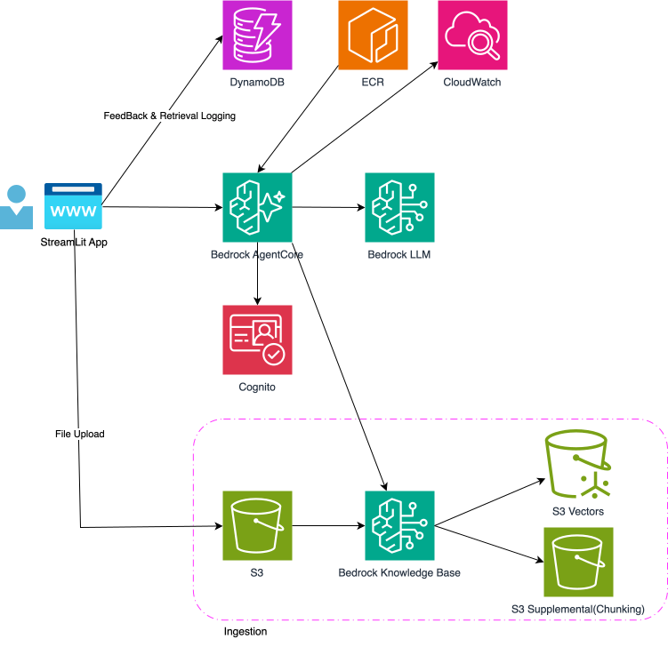
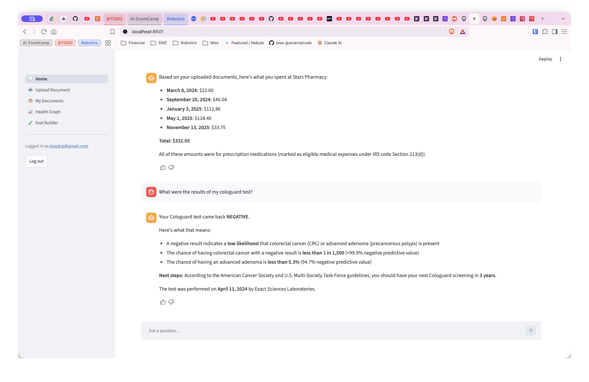
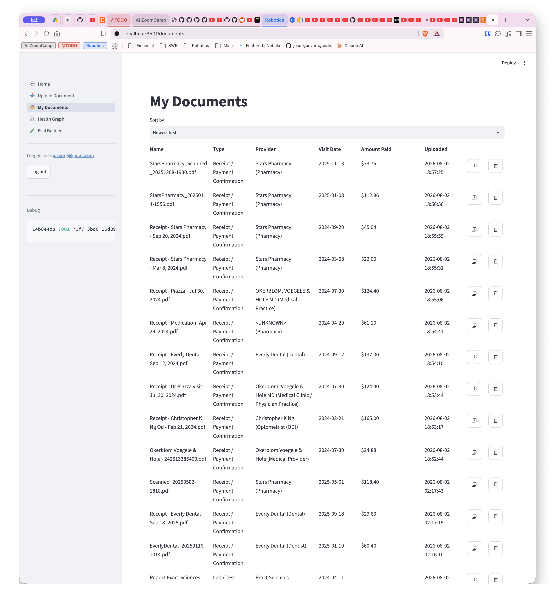
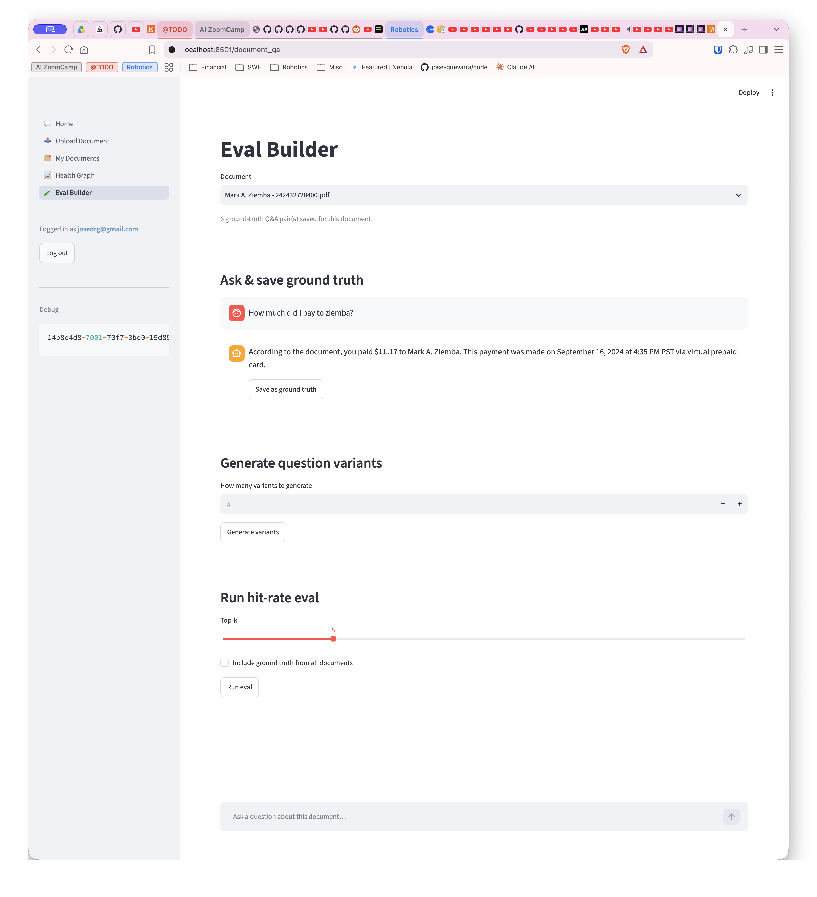
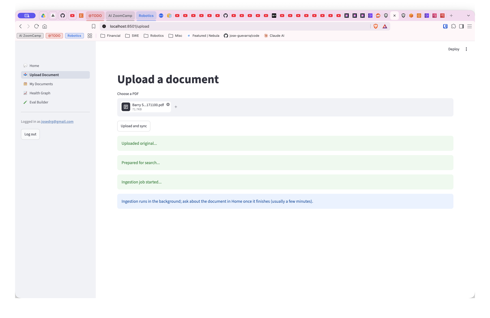
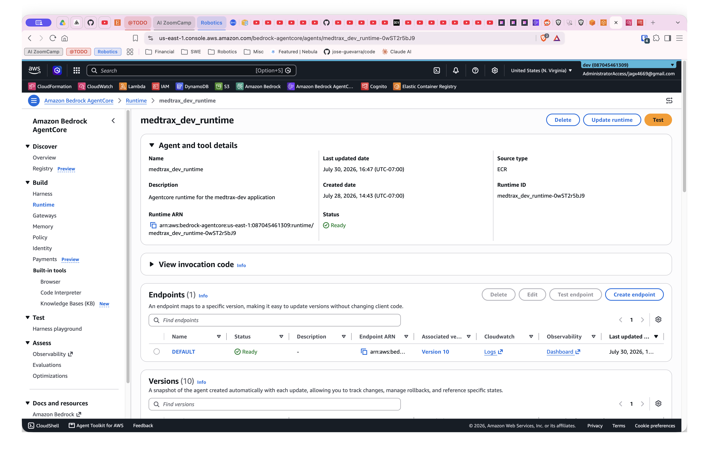

# MedTrax - Personal Health Records app


## Table of Contents

- [Problem Description](#problem-description)
- [Solution](#solution)
- [Technology Stack](#technology-stack)
- [Architecture](#architecture)
- [Project Structure](#project-structure)
- [Demo](#demo)
  - [Click here to watch the demo ▶️▶️](#click-here-to-watch-the-demo-️️)
  - [ScreenShots](#screenshots)
- [Results](#results)
  - [Data](#data)
  - [Evaluation](#evaluation)
- [Future Improvements](#future-improvements)
- [Installation](#installation)
  - [Requirements](#requirements)
- [Deploy Instructions](#deploy-instructions)
  - [Step 1](#step-1)
  - [Step 2 - Build initial Docker image](#step-2---build-initial-docker-image)
  - [Step 3 - Re Deploy](#step-3---re-deploy)
  - [Step 4 - Create a user in AWS Cognito](#step-4---create-a-user-in-aws-cognito)
- [Web app](#web-app)
- [Acknowledgements](#acknowledgements)
- [Author](#author)

## Problem Description

Medical receipts, bills, EOBs, and records pile up across different
providers, pharmacies, and visits, in paper and digital form. When you need
to answer a simple question later — how much did I spend on doctor visits
this year, what did that specialist say about my last checkup, do I have a
copy of that lab result — you're stuck digging through drawers, inboxes, and
photo rolls with no easy way to search or add it all up.

## Solution

Upload your medical receipts and documents in one place, and the app
organizes them automatically so you can browse and sort your spending by
provider, date, or amount at a glance. Ask it questions in plain English —
like "how much did I spend at Dr. Smith's office last year" or "what did my
last blood test show" — and get answers pulled directly from your own
documents, so you always know exactly where the information came from.

WARNING: <u>This is a personal project. This project is not HIPAA compliant and should not be used in production.</u>

## Technology Stack

- **Python 3.14**, managed with `uv`
- **Frontend**: Streamlit (multi-page: login, chat, upload, documents)
- **Agent**: LangGraph + LangChain, running on Amazon Bedrock AgentCore Runtime, packaged as a Docker container in ECR
- **LLM**: Amazon Bedrock (Claude Haiku 4.5)
- **RAG**: Bedrock Knowledge Base with S3 Vectors + Titan embeddings v2
- **Auth**: Amazon Cognito (JWT)
- **Storage**: S3 (documents), DynamoDB (feedback + retrieval logs)
- **Infra**: Terraform
- **Observability**: OpenTelemetry

## Architecture




The web app is a multi-page Streamlit UI: log in via Cognito, upload health
records, browse them in a sortable table (type, provider, visit date, amount
paid — pulled out during ingestion), and chat with an assistant that answers
questions grounded in your own documents.

A chat request goes to the Bedrock AgentCore Runtime, a containerized
LangGraph agent that decides whether to retrieve from the Bedrock Knowledge
Base, then streams the answer back token by token along with the source
documents it used. Every answer gets a thumbs up/down, and both the sources
and the feedback are logged to DynamoDB — that log is the eval loop: a
hit_rate script replays a set of known question → expected-document pairs
against the retriever and reports how often the right document lands in the
top-k results, so retrieval quality can be checked after changes.

Uploaded documents land in S3, which feeds the Knowledge Base's ingestion
pipeline (chunking + embedding into an S3 Vectors index); deleting a document
removes it and kicks off a re-sync. Both the web app and the agent runtime
validate the same Cognito JWT, so retrieval, chat, and document access all
stay scoped to the user who made the request.


## Project Structure

```
├── bootstrap.sh
├── infra
│   ├── mtx
│   │   ├── agentcore_runtime.tf
│   │   ├── bedrock_kb.tf
│   │   ├── cognito.tf
│   │   ├── data.tf
│   │   ├── dynamodb.tf
│   │   ├── example.tfvars
│   │   ├── output.tf
│   │   ├── providers.tf
│   │   ├── terraform.tfstate
│   │   ├── terraform.tfstate.backup
│   │   ├── terraform.tfvars
│   │   ├── tools
│   │   │   ├── change_pwd.sh
│   │   │   ├── env.agent.template
│   │   │   ├── test_agent.sh
│   │   │   └── upload-agent-to-ecr.sh
│   │   └── variables.tf
│   └── tests
│       ├── main.py
│       ├── pyproject.toml
│       ├── README.md
│       ├── test_agentruntime.py
│       └── uv.lock
├── media
│   ├── archsvg.svg
│   └── MedTraxArchitecture.drawio
├── pyproject.toml
├── README.md
├── src
│   ├── Makefile
│   └── mtx_agent
│       ├── app.py
│       ├── Dockerfile
│       ├── eval
│       │   ├── hit_rate.py
│       │   └── test_set.jsonl
│       ├── llm_model.py
│       ├── prompts.py
│       ├── pyproject.toml
│       ├── README.md
│       ├── requirements.txt
│       ├── RetrieverAgent.py
│       └── RetrieverTool.py
├── uv.lock
└── web
    ├── app.py
    ├── core
    │   ├── __init__.py
    │   ├── agent_client.py
    │   ├── auth.py
    │   ├── config.py
    │   ├── document_qa.py
    │   ├── eval_gen.py
    │   ├── eval_retrieval.py
    │   ├── eval_store.py
    │   ├── extraction.py
    │   ├── feedback.py
    │   ├── retrieval_log.py
    │   └── s3_upload.py
    ├── pyproject.toml
    ├── README.md
    ├── uv.lock
    └── views
        ├── chat.py
        ├── document_qa.py
        ├── documents.py
        ├── health_graph.py
        ├── login.py
        └── upload.py

```


# Demo


### Click here to watch the demo ▶️▶️

 ➡️▶️ [MedTrax Web App](https://youtu.be/UuF7GrneWJ0?si=X02M14yZnZmdi_jj)


 ➡️▶️ [MedTrax AWS Backend](https://youtu.be/vFB5mV2FYG8?si=OR2MobEgTTGeOKOG)


### ScreenShots













# Results


## Data

I used personal medical reciepts and medical test results over several
years.   


## Evaluation

Retrieval quality is measured with a document-level hit rate: for a set of
`{question, expected_document}` pairs, does the correct source document show
up among the top-k results the Bedrock Knowledge Base retriever returns for
that question (matched by filename, since each document is ingested as one
markdown blob with no page-level boundaries to check finer-grained precision
against)? This checks whether retrieval found the right document to answer
from — it doesn't score the chat agent's final answer text.

Ground truth lives in `src/mtx_agent/eval/test_set.jsonl` and is built up two
ways from the "Eval Builder" page: manually, by asking a single document
questions directly and saving good question/answer pairs against it; and
automatically, by asking an LLM to generate additional phrasings of a
question that should still resolve to the same document, to test whether
retrieval holds up across different ways of asking the same thing, not just
the original exact wording. `src/mtx_agent/eval/hit_rate.py` replays every
row in the file against the live retriever and reports the hit rate.

**Current results** (56 questions across the 10 documents uploaded so far —
48 of them LLM-generated phrasings without a hand-verified reference answer,
the rest manually authored):

```
hit_rate = 46/56 = 82.14%
Questions: 56  |  Documents: 10  |  Missing answer: 48
```


## Future Improvements

- Migrate to Back For Front (BFF) architechture behind API GW for security
- Add guard rails and rate limiting for costs optimization
- Add longterm memory and shorterm memory 
- Add text search with Open Search for more accurate searches


## Installation

NOTE: 
Best way to deploy and run application is in VS Code DevContainers.
In VS Code, install the DevContainers extension.   


### Requirements

- Docker
- Python 3.14
- Run from Linux (or VSCode Devcontainers)
- Terraform
- AWS Account
- AWS Cli


Download repo and run bootstrap script that installs
Python deps and Terraform.


```
git clone https://github.com/jose-guevarra/medtrax.git
cd metrax

git checkout -b main 8704776

```

```
sh bootstrap
```


## Deploy Instructions

### Step 1

Set your AWS_PROFILE and AWS_REGION=us-east-1


Run Terraform to deploy infrastructure

```
cd infra/mtx
terraform init
terraform plan
terraform apply
```

<u>NOTE: This will fail the FIRST time due to no ECR image. (Continue to next step to fix.)</u>

### Step 2 - Build initial Docker image

NOTE: Most DevContainer installations are not build to do container-in-container
Docker installation.  This means you will have to build the Docker image
on your host machine(machine running VSCode).  You should set you AWS credentials
on the host computer and run the `sh upload-agent-to-ecr.sh` command on the host manchine.

Build and upload initial ECR image.

```
cd infra/mtx/tools
sh upload-agent-to-ecr.sh
```

You should see a new Docker image in ECR in your AWS Account.


### Step 3 - Re Deploy

Now that the image is in ECR, AWS Bedrock AgentCore can use it as the Runtime for the Agent.  So 
deploy using Terraform again.

```
terraform apply
```

When successfuly, take note of Output values of deployed resource.


### Step 4 - Create a user in AWS Cognito

Go to AWS Cognito -> Users -> Create User.

Create a user and set their password.  You can then login as that user.


# Web app

Create `web/.env` from the template file: `web/.env.example`.
Fill in all the values from output from Terraform apply and 
by looking in the AWS Console for resource identifiers. 

Now start the web app.

```
cd web
uv run streamlit run app.py
```

Upload a file then go to the home page and ask questions about the doc.

Here are some sample files:

https://drive.proton.me/urls/JQCZ3ZQN2M#vHTnXdCCbgFr


## Acknowledgements

- [DataTalksClub](https://datatalks.club) for the LLM Zoomcamp
- We extend our sincere gratitude to Alexey Grigorev and the DataTalks Club team for their expert guidance, valuable Slack  support, and for creating this exceptional learning opportunity through the LLM course.


## Author

Developed as part of LLM Zoomcamp 2026 by Jose Guevarra. 